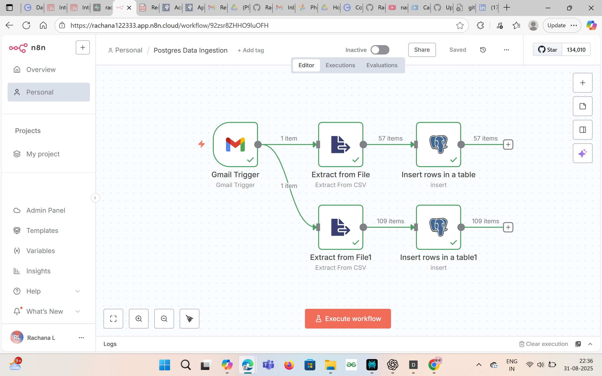

# Supply Chain Data Analysis using AI Tools (Quadratic + N8N)

This project demonstrates how **Quadratic (AI-powered spreadsheet)** and **N8N (workflow automation tool)** can be combined to analyze supply chain data, automate ETL processes, and generate business insights.

---

## 🚀 Project Overview
- Automated ingestion of daily sales data from Gmail attachments into **Postgres** using **n8n**.
- Data transformation and KPI calculation (On-Time, In-Full, OTIF).
- AI-powered spreadsheet (**Quadratic**) used for advanced data exploration and forecasting.
- Automated workflows → reduced manual effort in supply chain reporting.

---

## 🛠️ Tech Stack
- Quadratic (AI Spreadsheet)
- N8N (Workflow Automation)
- PostgreSQL
- GitHub (Documentation & Version Control)

---

## 📂 Repository Structure
- `Dataset/` → Sample datasets for testing.
- `postgres_ingestion.json` → n8n workflow to ingest Gmail attachments into Postgres.
- `SupplyChainAnalysis.grid` → Quadratic spreadsheet for KPI analysis.
- `README.md` → Documentation.

---

## ▶️ How to Use

### 1. N8N Workflow
1. Import `postgres_ingestion.json` into your n8n instance.
2. Configure Gmail + Postgres credentials.
3. Run the workflow to auto-ingest sales data into Postgres.

### 2. Quadratic Spreadsheet
1. Open `SupplyChainAnalysis.grid` in [Quadratic](https://www.quadratichq.com/).
2. Explore KPIs such as **On-Time, In-Full, OTIF**.
3. Perform forecasting and analyze supply chain bottlenecks.

---

## 📊 Key Insights
- Identified supplier delays reducing OTIF by ~12%.
- Automated ETL pipeline cut down manual reporting effort.
- Improved visibility into demand forecasting gaps.

---

## 📸 Project Preview

---

## 📜 License
MIT License – free to use and adapt.

